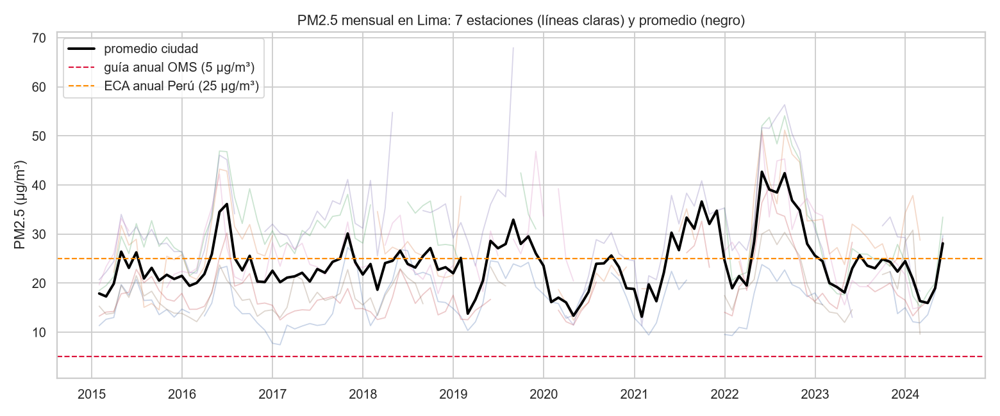
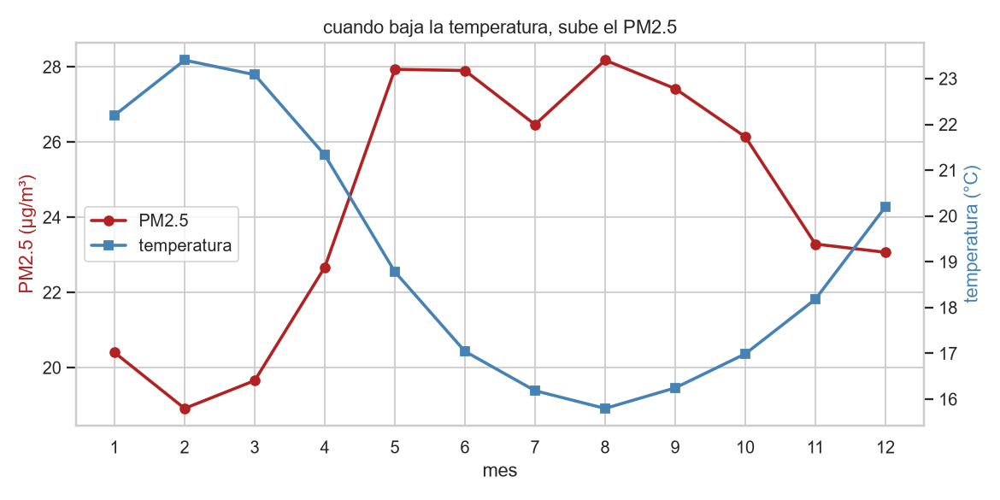

# Clima y calidad del aire en Lima Metropolitana

¿Qué tan contaminado está el aire de Lima y por qué empeora en invierno? Este proyecto combina datos de calidad del aire de SENAMHI entre 2015 y 2024 con información climática de ERA5 para cada estación de monitoreo. El proceso de descarga, limpieza, análisis y visualización se ejecuta con solo dos scripts y puede reproducirse fácilmente.

**Demo en vivo**: [calidad-aire-de-lima.streamlit.app](https://calidad-aire-de-lima.streamlit.app)



## Hallazgos

La OMS recomienda no pasar de 15 µg/m³ de PM2.5 como promedio diario. En cuatro de las siete estaciones de Lima eso se incumple más del 90% de los días. Hasta en Campo de Marte, la estación más limpia, ocurre uno de cada dos días. La norma peruana casi nunca se supera, pero su límite es tres veces mayor que el recomendado por la OMS.

La calidad del aire cambia según el distrito. San Juan de Lurigancho registra en promedio 31 µg/m³ de PM2.5, mientras que Campo de Marte alcanza 17. Las zonas del este y norte de Lima presentan los niveles más altos.

La contaminación aumenta en invierno: el PM2.5 es 32 % mayor que en verano y alcanza su punto máximo en agosto. Esto ocurre porque el aire frío y estable atrapa los contaminantes cerca del suelo. Por eso, la temperatura y el PM2.5 siguen ciclos casi opuestos:



En 2020, la cuarentena redujo el tránsito y el PM2.5 cayó 25 % respecto a 2019. Fue el año con el aire más limpio de toda la serie.

También se detectó que los datos oficiales estaban registrados en UTC y no en la hora de Lima. La pista fueron los picos de contaminación de Año Nuevo, que aparecían cinco horas después de lo esperado. Corregir este desfase fue necesario para relacionar correctamente la contaminación con el clima.

## Dashboard

Aplicación en Streamlit con filtros por contaminante, estación y año. Incluye gráficos de evolución, comparación entre estaciones, patrones por hora y estación del año, relación con la temperatura y el viento, y un mapa de las estaciones.

Está desplegada en [calidad-aire-de-lima.streamlit.app](https://calidad-aire-de-lima.streamlit.app); para correrla en local:

```bash
streamlit run dashboard/app.py
```

## Cómo reproducirlo

```bash
# entorno
python -m venv .venv
.venv\Scripts\activate       # windows
pip install -r requirements.txt

# datos: descarga (~90 MB) y limpieza
python src/descargar_datos.py
python src/limpieza.py

# analisis y dashboard
jupyter lab notebooks/
streamlit run dashboard/app.py
```

Los datos originales no están incluidos en el repositorio, pero el script puede descargarlos nuevamente. Los archivos procesados sí están disponibles, por lo que el dashboard y los notebooks funcionan sin descargas adicionales.

## Estructura

```
├── datos/          # crudos (no versionados) y procesados (parquet)
├── src/            # descarga y limpieza
├── notebooks/      # analisis exploratorio (01 contaminantes, 02 cruce con clima)
├── dashboard/      # app streamlit
├── imagenes/       # figuras del readme
└── Docs/           # definicion, plan, decisiones tecnicas y glosario
```

## Fuentes y limitaciones

- [Monitoreo de contaminantes del aire en Lima Metropolitana — SENAMHI](https://www.datosabiertos.gob.pe/dataset/monitoreo-de-los-contaminantes-del-aire-en-lima-metropolitana-servicio-nacional-de), vía la Plataforma Nacional de Datos Abiertos. Solo trae PM10, PM2.5 y NO2; entre 17% y 58% de horas sin dato según estación y contaminante.
- Clima horario de [Open-Meteo](https://open-meteo.com/) (reanálisis ERA5) en las coordenadas de cada estación. Es un modelo interpolado, no una estación física en ese punto: sirve para estudiar relaciones clima-contaminación, no para reportes meteorológicos oficiales.
- El dataset meteorológico de SENAMHI en datos abiertos se evaluó y se descartó: sus únicas estaciones del departamento de Lima están en la sierra, a más de 3,000 msnm.
